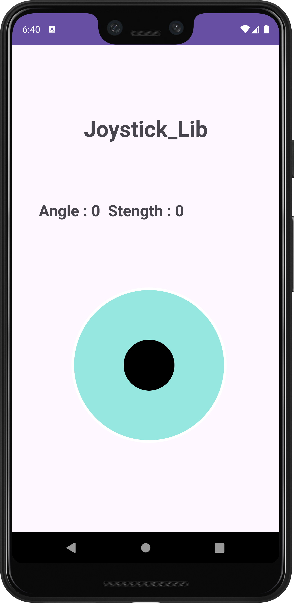

# Joystick_Lib

**Joystick_Lib** is a custom joystick library for Android, built to simplify the integration of joystick features into Android applications. The library provides an easy-to-use interface for controlling and responding to joystick actions, making it an ideal choice for game developers and applications requiring advanced user input.

## Features

- Easy integration of joystick functionality into Android apps.
- Customizable joystick UI and behavior.
- Support for multiple joystick events such as movement and button presses.
- Lightweight and optimized for performance.

## Requirements

- Android SDK 21 and above
- Java 8 and above

## Installation

Add the following dependencies in your `build.gradle` file:

```gradle
dependencies {
    implementation("com.github.Krusshnaa:Joystick_Lib:1.0")
}
```


    
```gradle.settings
dependencyResolutionManagement {
    repositoriesMode.set(RepositoriesMode.FAIL_ON_PROJECT_REPOS)
    repositories {
        google()
        mavenCentral()
        maven(uri("https://jitpack.io"))
    }
}
```

## How to Use

### Import the Library

First, import the Joystick library in your activity:

```java
import com.example.joystick_lib.Joystick_Lib;
```

### Initialize Joystick_Lib

Create an instance of the `Joystick_Lib` class and initialize it in your `Activity`:

```java
Joystick_Lib joystickLib = new Joystick_Lib(this);
```

### Access Joystick Functions

You can now access various joystick functions. Here is an example of handling joystick events:

```java
joystickLib.setOnMoveListener(new Joystick_Lib.OnMoveListener() {
    @Override
    public void onMove(float angle, float strength) {
        // Handle movement here
        Log.d("Joystick", "Angle: " + angle + ", Strength: " + strength);
    }

    @Override
    public void onPress() {
        // Handle button press
        Log.d("Joystick", "Button Pressed");
    }

    @Override
    public void onRelease() {
        // Handle button release
        Log.d("Joystick", "Button Released");
    }
});
```

### Customization

You can customize the joystick appearance and behavior using attributes in the XML layout file. Here's an example:

```xml
<com.example.joystick_lib.Joystick_Lib
    android:id="@+id/joystick_Lib"
    android:layout_width="313dp"
    android:layout_height="333dp"
    android:backgroundTint="#FFFFFF"
    app:JV_backgroundColor="#97E7E1"
    app:JV_backgroundSizeRatio="75%"
    app:JV_borderColor="#FFFFFF"
    app:JV_borderWidth="4dp"
    app:JV_buttonColor="#000000"
    app:JV_buttonSizeRatio="25%"
    app:JV_fixedCenter="false"
    app:layout_constraintBottom_toBottomOf="parent"
    app:layout_constraintEnd_toEndOf="parent"
    app:layout_constraintHorizontal_bias="0.551"
    app:layout_constraintStart_toStartOf="parent"
    app:layout_constraintTop_toTopOf="parent"
    app:layout_constraintVertical_bias="0.77" />
```

### Example

Here’s a complete example of implementing the joystick in an `Activity`:

```java
import androidx.appcompat.app.AppCompatActivity;
import android.os.Bundle;
import android.util.Log;
import com.example.joystick_lib.Joystick_Lib;

public class MainActivity extends AppCompatActivity {
    private Joystick_Lib joystickLib;

    @Override
    protected void onCreate(Bundle savedInstanceState) {
        super.onCreate(savedInstanceState);
        setContentView(R.layout.activity_main);

        joystickLib = findViewById(R.id.joystick_Lib);
        joystickLib.setOnMoveListener(new Joystick_Lib.OnMoveListener() {
            @Override
            public void onMove(float angle, float strength) {
                Log.d("Joystick", "Angle: " + angle + ", Strength: " + strength);
            }

            @Override
            public void onPress() {
                Log.d("Joystick", "Button Pressed");
            }

            @Override
            public void onRelease() {
                Log.d("Joystick", "Button Released");
            }
        });
    }
}
```

## Example Image

Here is an example of what the joystick UI might look like when implemented in an app:  

  


    

## License
This project is licensed under the BSD 3-Clause "New" or "Revised" License. You are free to use, modify, and distribute this project as long as proper attribution is provided.

## Contributing
Contributions are welcome! Feel free to open issues or submit pull requests if you have suggestions or improvements.
